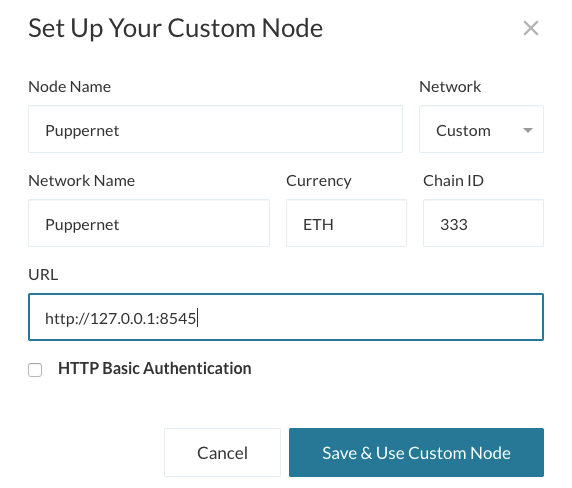
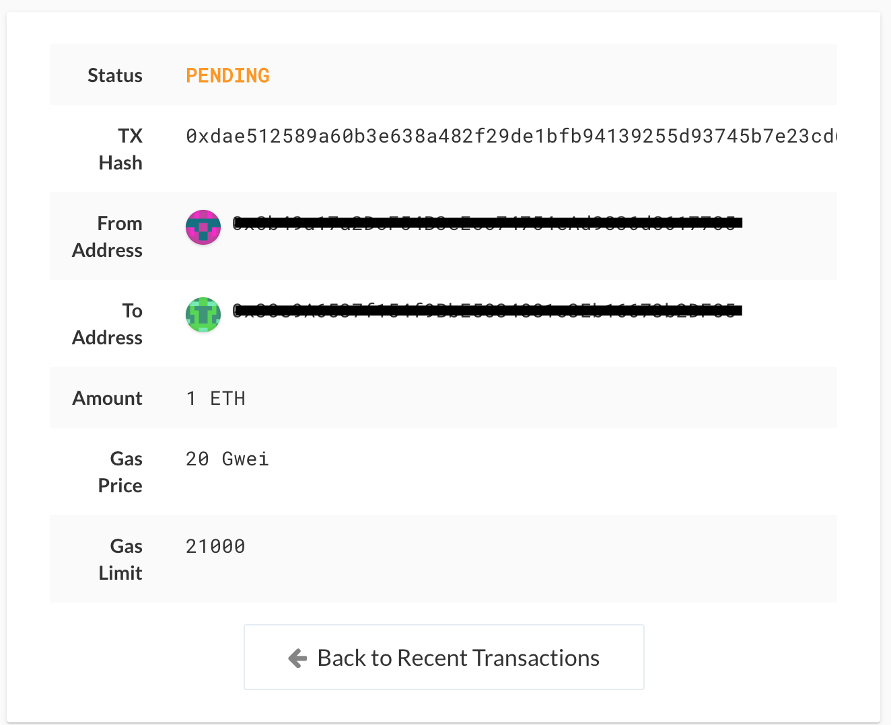

# Blockchain-homework
ZBank process to set up blockchain testnet
1. Open a terminal window, navigate to the `Blockchain-Tools` folder and type the following command:
* ./geth --datadir node# (# - enter a number for the node)
 
create a second node using the same command
 

2. Open a new terminal window, navigate to the `Blockchain-Tools` folder and type the following command:

 ```bash
 ./puppeth
 ```
 This should show the following prompt:

 
 3. Type in a name for your network, like "zbank" and hit enter to move forward in the wizard.

* Type `2` to pick the `Configure new genesis` option, then `1` to `Create new genesis from scratch`:

 
 4. Now you have the option to pick a consensus engine (algorithm) to use.

* Type `2` to choose `Proof of Authority` and continue. Type  `15` for the amount of seconds for each block should take.
![proof-of-authority] (screenshots/proof-of-authority.png)

5. You will be asked to enter an account to seal. Enter the public key from the nodes you created in step 1

* Copy and paste a the public address from your first node, without the `0x` prefix and hit enter.
* Copy and paste a the public address from your second node, without the `0x` prefix and hit enter.
![Accounts] (screenshots/accounts.png)

* Repeat the same step for the entering the accounts to seal for which accounts to prefund.
![prefund] (screenshots/prefund.png)

![Accounts] (screenshots/Accounts.png)

* Once you paste an address and hit enter, hit enter again on the blank `0x` address to continue the prompt.

* Continue with the default option for the prompt that asks `Should the precompile-addresses (0x1 .. 0xff) be pre-funded with 1 wei?` by hitting enter again,
 until you reach the `Chain ID` prompt.
 * Come up with a number to use as a chain ID (e.g. `333`) type it, then hit enter.

 * When you come back to the main menu, choose `2` `Mange existing genesis`
 ![Manage-Genesis] (screenshots/manage-genesis.png)
 
 6. First, export your genesis configuration into a `yournetworkname.json` file as follows:

* In the `puppeth` prompt, navigate to the `Manage existing genesis` by typing `2` and hitting enter.

* You may have to type your network name again first if you're launching `puppeth` fresh.

* Then, type `2` again to choose the `Export genesis configurations` option, and continue with the default (current) directory by hitting enter:

* This will export several `yournetworkname.json` files -- you only need the first one without `aleth`, `parity`, or `harmony` suffixes.


* Exit `puppeth` by using the `Ctrl+C` keys combination.

 * Confirm Puppeth configuration by going to the `blockchain-tools` folder and navigating to the folder you created when you downloaded the json files.
 

Now, it's time to initialize and tell the nodes to use your genesis block!

* Initialize the first node, replacing `yournetworkname.json` with your own:

 ```bash
 ./geth init yournetworkname.json --datadir node#
 ```

You should see this success message:


* Since you only initialize your nodes once, you don't need to copy anything into your notes here.

* Run the same command for `node#`.

 ```bash
 ./geth init yournetworkname.json --datadir node#
 ```
 * Unlock your nodes by running the following commands
 ./geth --datadir node3 --unlock "2caa4135906695f7722e80ee91ae64c9019ed085" --mine --minerthreads 5

./geth --datadir node4 --unlock "ff926a17f27098cc01156f908bdd549fcfcec46b" --port 30304 --rpc --bootnodes "enode://71f3f621286f8d7ebf9f70e35274956e09d7f4e308e08faedddfdd80462d7c8057cd082931526fbd5ef2d10c5e67651ceaaa4e2aed2c5e8196df046ad0294a76@71.172.6.7:30303" --ipcdisable —allow-insecure-unlock

7. * Open `mycrypto` app on your desktop.
* Select `Change Network`
* Scroll down to the bottom and select `custom network`
* When the popup appears

* Enter the information from the creation of the genesis account.
* On the next screen `how to access your wallet` select `keystore file`. Select your first `node` you created. Enter your `blockchain tools password` Once you do that your screen should look like this:

* Copy down the account addres.
* Select `Change Wallet`
* Repeat the step above and select the second node you set up.

* Copy the first account address and paste it into the `To Address` field.
* Enter the amount. press `send transaction`
* You should receive a confirmation that the transaction went through

* Select TX Status in the banner. It will bring you into the transaction status. It will go from Pending to Completed.



  

